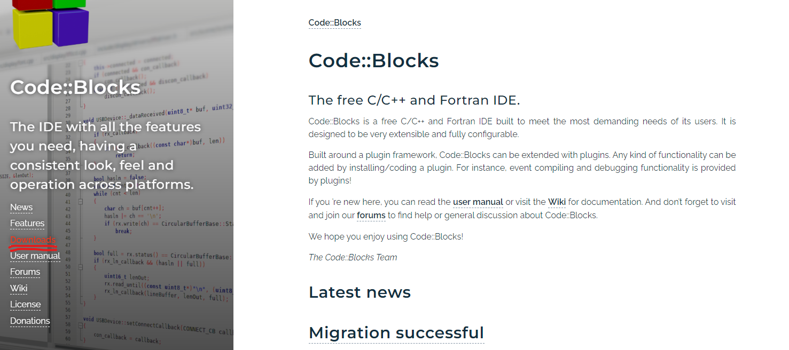
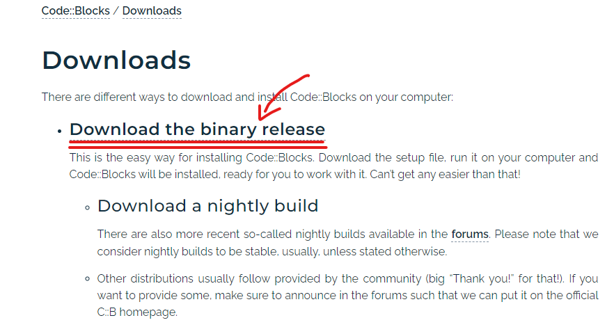
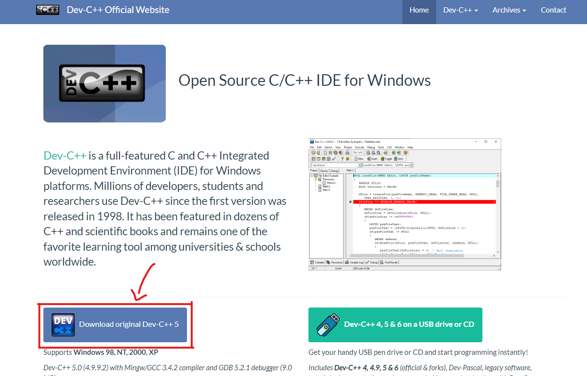
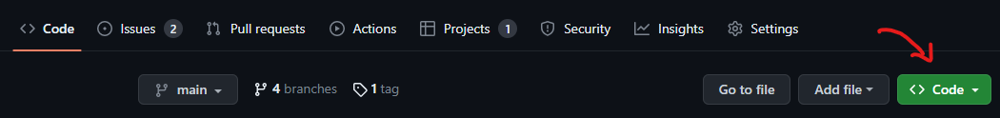
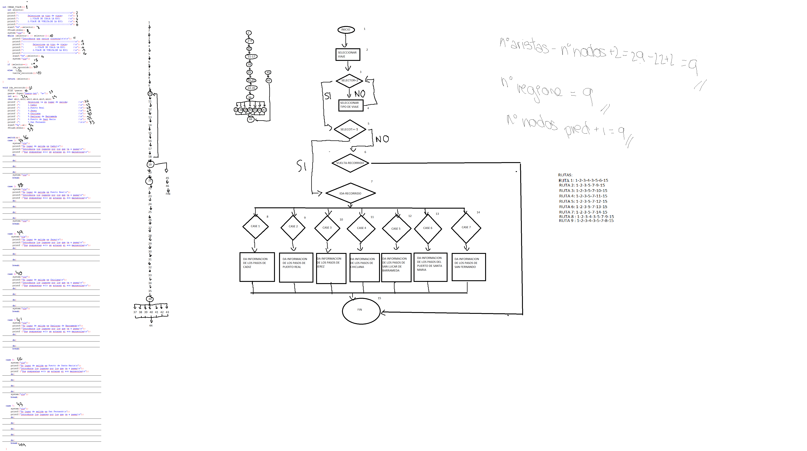

# Metodología de la Programación
### Edison Marimon Cook
### Claudia García-Matarredona Urbano
### Yedra García Sánchez
### Álvaro Fiusa López
## **ESI-SHARE**
---
### **Índice**
1. [Introducción](#introducción)
2. [Documentación de usuario](#documentación-de-usuario)
    * [Descripción funcional](#descripción-funcional)
    * [Tecnologías](#tecnologías)
    * [Manual de instalación](#manual-de-instalación)
    * [Acceso al sistema](#acceso-al-sistema)
    * [Manual de referencia](#manual-de-referencia)
    * [Guía del operador ](#guía-del-operador)
3. [Documentación del sistema](#Documentación-del-sistema)
   *  [Especificación del sistema](#Especificación-del-sistema)
   *  [Módulos](#Módulos)
   *  [Plan de pruebas](#Plan-de-pruebas)
   *  [Referencias](#referencias)
---
### **Introducción**
El objetivo es realizar una versión simplificada de BlablaCar para facilitar la compartición de coches entre miembros de la
comunidad universitaria de la Escuela Superior de Ingeniería. 

## **Documentación de Usuario**
### **Descripción funcional**
El propósito del sistema es la facilitación de acceso a coches compartidos para así conseguir un flujo dinámico y seguro para llegar al campus.
El sistema es muy simple, consta de dos opciones principales *login* y *sign up*.
   * login: entrada a la aplicación con un usuario y contraseña.
   * sign up: registro de usuario con su nombre completo y contraseña.
Posteriormente habrá varias opciones dependiendo de su estatus, que puede variar de usuario normal a superusuario o admin. En el caso de admin la manipulación de información será absoluta. En el caso de usuario se utilizará para usar y crear el servicio de transporte.

### **Tecnologías**
Los siguientes programas son los que se han utilizado para el desarrollo de este proyecto:
* [Code::Blocks](https://www.codeblocks.org/): Versión 20.03
* [Dev-C++](https://www.bloodshed.net): Versión 4.9.9.2
* [Visual Studio Code](https://code.visualstudio.com): Versión 1.77.3
  
### **Manual de instalación**
* Code::Blocks. Las características mínimas del hardware son las siguientes: CPU equivalente a un Intel Pentium 4 2.00GHz, 300MB de espacio, GPU equivalente a ATI FireGL T2-128 y 600MB de RAM instaladas.

Si quiere utilizar Code::Blocks váyase a la página web dándole click en el nombre en la sección de [technologías](#tecnologías). 
Cuando ya entró haga click al botón de "Downloads" en la parte de la izquierda de la página web como aquí:
___

___
Luego haga click en "Download the binary release":
___

___
Despues de esto haga click en el primer link de "Sourceforge.net" en la parte de de Microsoft Windows, Linux o Max OS X dependiendo de el sistema operativo que esté utilizando.
La descarga comenzará automáticamente. Siga los pasos indicados hasta que esté descargado. 
___
* Dev-C++. Las características mínimas de hardware son las siguientes: CPU equivalente a Intel Pentium 233MHz, 128MB de RAM, 50MB de espacio disponible.
  
Si está utilizando "Dev-C++" dale click en el nombre en el apartado de [technologías](#tecnologías).
Después de hacer esto dale click en la parte inferior de la pantalla en la cajita de "Download original Dev-C++ 5" como aquí:
___

___
La descarga comenzará automáticamente. Después de esto siga las instrucciones indicadas.
___
* Visual Studio Code. Las características mínimas de hardware son las siguientes: CPU equivalente a Intel Pentium 4, Procesador de 1.6GHz, 1GB de RAM, 200MB de espacio disponible.

Para descargar "Visual Studio Code" haga click en su nombre en el apartado de [technologías](#tecnologías). Siguiente dale click en el botón de "Download for Windows" en la parte central de la pantalla como aquí:
___

___
La descarga comenzará automáticamente. Después de esto siga las instrucciones indicadas.

### **Acceso al sistema**
Tiene dos opciones para utilizar este programa:
   1. Clonear el repositorio Git mediante [este link](https://github.com/EdisonMarimonCook/Esi-Share.git)
   2. Descargar el archivo ZIP dándole click al botón "<>Code":
___

___
Y después en "Download ZIP":
___

___
Extrae los ficheros y clickee "Abrir con:". Ahora busque el programa con el que quiera abrir los ficheros y listo.

### **Manual de referencia**
El programa goza de un amplio menú de opciones dividido en dos secciones: 
   1. Viajes: donde el usuario puede buscar viajes a los que unirse. Además de subir, eliminar y modificar sus propios viajes.
   2. Vehículos: donde el usuario puede añadir, eliminar y modificar sus vehículos.
Esto nos permite emitir menos cantidades de CO2 además de conceder a los alumnos la oportunidad de conocer a estudiantes de diferentes grados.

Podemos destacar algunos errores comunes y cómo resolverlos:
   1. ¿Cómo me convierto en admin?
      -Para conseguir tal grado de autoridad es necesario que otro administrador modifique su estatus "user" a "admi" en la base de datos.
   2. ¿Por qué no hay ningún viaje disponible?
      -Esto se puede deber a un error de lectura del fichero, por lo que debería cerrar y volver a iniciar la aplicación o porque en efecto no hay ningún viaje que cumpla con los requisitos buscados.
   3. ¿Por qué al borrar el viaje o vehículo posicionado en la última línea del fichero aparece el carácter 'ÿ'?
      -Este error se debe a una variable con contenido basura, por tanto no puede hacer nada a no ser que sea admin. En caso de ser admin solamente debe entrar en el fichero correspondiente y eliminar a mano el carácter.
   4. Ante cualquier otro error se recomienda resetear la aplicación ya que puede haber fallos en la transferencia de datos a la hora de leer los ficheros.

### **Guía del operador**
El administrador tiene acceso a la base de datos para gestionar y/o eliminar: viajes, vehículos y usuarios. Además tiene la opción de modificar su contraseña.

## **Documentación del Sistema**
### **Especificaciones del sistema**
La descripción oficial del sistema es la siguiente:

El sistema dispondrá de dos perfiles de usuarios:
• Un perfil de usuario, con acceso a los datos de su propio perfil, que podrá realizar publicaciones de
viajes, gestión de vehículos compartidos, etc.
• Un perfil de administrador, que realizará tareas de configuración del sistema tales como
tratamiento de usuarios, trayectos, etc.
Para conservar toda la información y volverla a utilizar en posteriores ejecuciones del programa, todos los datos de ESI-SHARE estarán almacenados en ficheros. De esta forma, al iniciar el sistema, es necesario que dicha información se vuelque a las estructuras de datos correspondientes en memoria, y al cerrar el programa, se vuelvan a almacenar todos los datos actualizados en los ficheros, realizándose así el funcionamiento de ESI-SHARE en memoria principal. Los ficheros que van contener dicha información son:

___

* Usuarios.txt, almacenará la información de los usuarios del sistema con los siguientes campos separados por guiones:
   * Identificador del usuario (Id_usuario), 4 dígitos.
   * Nombre completo del usuario (Nomb_usuario), 20 caracteres máximo.
   * Población (Localidad), con 20 caracteres máximo, para indicar la ubicación desde la que saleel usuario con su vehículo compartido.
   * Perfil del usuario (Perfil_usuario): «administrador» o «usuario».
   * Nombre de usuario (Usuario) para acceder al sistema, 5 caracteres.
   * Contraseña para acceder al sistema (Contraseña), 8 caracteres.
    
___

* Vehículos.txt, almacenará la información de los vehículos que el usuario haya dado de alta en el sistema y que utilizará para compartir en sus viajes. Los campos, separados por guiones, son los que se describen a continuación:
   * Matrícula del vehículo (Id_mat), 7 caracteres.
   * Identificador del usuario (Id_usuario) propietario del vehículo, 4 dígitos.
   * Nº de Plazas (Num_plazas), 1 dígito, para indicar el número de plazas de las que dispone el coche, sin contar la plaza del conductor.
   * Descripción del vehículo (Desc_veh), 50 caracteres, para indicar los datos del vehículo como marca, modelo, color, etc.
   
___

* Viajes.txt, almacenará la información de los viajes publicados por los usuarios del sistema, con los siguientes campos separados por guiones:
   * Identificador del viaje (Id_viaje), 6 dígitos.
   * Matrícula del vehículo (Id_mat) que se comparte, 7 caracteres.
   * Fecha del viaje (F_inic), formato día/mes/año.
   * Hora de inicio (H_inic), formato hora:minutos, usando el sistema horario de 24 horas.
   * Hora de llegada (H_fin), formato hora:minutos, usando el sistema horario de 24 horas.
   * Plazas libres (Plazas_libre), número de plazas que aún quedan sin ocupar, 1 dígito.
   * Viaje: Ida o Vuelta. Para simplificar, cada viaje puede ser únicamente de ida o vuelta, pero no ambos.
   * Importe total del viaje.
   * Estado del viaje (Estado), para indicar si el viaje está:
      * Abierto: posibilidad de añadir usuarios al viaje.
      * Cerrado: no quedan plazas disponibles.
      * Iniciado: el viaje ya ha comenzado pero permite añadir más usuarios en el caso de haber plazas libre.
      * Finalizado: el viaje ha finalizado.
      * Anulado: el viaje no se ha realizado.
 
___

* Pasos.txt, almacenará la información relativa a las poblaciones por las que el usuario, del coche compartido, está dispuesto a pasar durante su viaje, con objeto de recoger a otros usuarios. Contendrá los siguientes campos separados por guiones:
   * Identificador del viaje (Id_viaje), 6 dígitos (debe coincidir con el Id_viaje de alguno de los viajes del fichero Viajes.txt).
   * Población de paso (Población), 20 caracteres máximo.
   
___

La descomposición del problema es la propuesta. Se ha realizado un "main.c" que se encarga de almacenar los datos de los fichero disponibles en sus estructuras para posteriormente ser modificadas y usadas en sus módulos correspondientes.
El main.c conecta con un menú de <login> y <sign-up> creado en "Users.c", al entrar en login dependiendo del usuario será direccionado a dos menús distintos que conectan con "Vehiculos_main.c" y "viajes_main.c". 
A su vez "vehiculos_main.c" conecta con "pasos.c" que funciona como filtro de búsqueda a la hora de encontrar un viaje.

### **Módulos**
#### **Usuarios**
   El módulo de usuarios tiene una funcionalidad simple, almacenar y crear usuarios. A la hora de crear usuarios se hace mediante la función de *sign-up*. Crea una id nueva generada de manera automática mediante un contador, además añade el nombre completo del usuario, su nombre de usuario y su contraseña, todo con la finalidad de tener una base de datos con usuarios habilitados con el poder de utilizar la aplicación y algunos pocos administradores con poder absoluto sobre la información de todos los módulos.
   
#### **Vehículos**
   El módulo de vehículos incluye la gestión completa de los vehículos del sistema, es decir, al entrar en el menú de vehículos:
  
            printf("|| ########################################### ||\n");
            printf("|| Seleccione una de las siguientes opciones:  ||\n");
            printf("||                                             ||\n");
            printf("|| 1. Añadir un vehículo                       ||\n");
            printf("|| 2. Modificar un vehículo ya existente       ||\n");
            printf("|| 3. Eliminar un vehículo                     ||\n");
            printf("|| 4. Salir del menú                           ||\n");
            printf("|| ########################################### ||\n\n");
   
   1. Seremos direccionados a la función: crear_vehiculo que nos pedirá una matrícula, número de plazas y descripción del vehículo. Estos datos serán escritos en el fichero "Vehiculos_file.txt" después de editar la estructura estruct_vehiculos.
   2. Seremos direccionados a la función: modificar_vehiculo que nos pedirá qué deseamos editar para cambiar la estructura ya mencionada.
   3. Seremos direccionados a la función: eliminar_vehiculo que copiará en un fichero auxiliar todas las líneas menos la indicada por la matrícula.
   
#### **Viajes**
   Aumenta la complejidad mediante un menú de mayor tamaño:
  
            printf("\n ########################");
            printf("\n |¿Qué desea hacer?     |");
            printf("\n |                      |");
            printf("\n |1. Buscar un viaje    |\n 
                       |2. Añadir un viaje    |\n 
                       |3. Eliminar un viaje  |\n 
                       |4. Modificar un viaje |\n 
                       |5. Salir              |\n");
            printf("  ########################\n\n");
   
   1. Seremos direccionados a la función: buscar_viaje que nos permitirá acceder a "pasos.c" mediante la pregunta de ¿Desea hacer un viaje de IDA o de VUELTA? (con respecto a la ESI). Una vez seleccionado el tipo de viaje usaremos el fichero de pasos como buscador, es decir, mediante otro menú:
   
            printf("|||||||||||||||||||||||||||||||||||||\n");
            printf("|   Seleccione su lugar de SALIDA:  |\n");
            printf("|              1.CADIZ              |\n");
            printf("|           2.PUERTO REAL           |\n");
            printf("|             3.JEREZ               |\n");
            printf("|            4.CHICLANA             |\n");
            printf("|      5.SANLUCAR DE BARRAMEDA      |\n");
            printf("|      6.PUERTO DE SANTA MARIA      |\n");
            printf("|          7.SAN FERNANDO           |\n");
            printf("|||||||||||||||||||||||||||||||||||||\n");
   
   accederemos a los viajes que pasen por la ciudad que deseemos. Por ejemplo, al elegir: 1.CADIZ, se nos mostrarán los viajes con paradas en Cádiz del fichero "pasos.txt", posteriormente tendremos que decidir qué viaje queremos realizar y volveremos a viajes para ver el resto de datos (hora, fecha, etc.) y seleccionar si es de nuestro agrado o no.
   
   2. Seremos direccionado a la función: subir_viaje que nos pedirá datos para completar una línea de información tanto en el fichero "viajes_file.txt" como en "pasos.txt".
   3. Seremos direccionados a la función: eliminar_viaje que sigue la misma filosofía que la función de eliminar_vehiculo del módulo anterior.
   4. Seremos direccionados a la función: modificar_viajes que nos enseñará un amplio menú de opciones a editar con sus respectivas restricciones. Estas modificaciones erán echas en la estructura: "estruct_viajes" y será guardada en el fichero una vez terminadas todas las modificaciones.
   
#### **Pasos**
   En pasos tenemos una recopilación de switchs y código duplicado personalizado para distintas ciudades y paradas. El objetivo es usar estos datos como filtro de búsqueda a la hora de buscar un viaje. Tiene una interfaz muy amplia con diferentes menús y opciones distintas.
   
### **Plan de prueba**
#### **Prueba de los módulos**
   
   
   
   
### **Prueba de integración**
            
   
   .pdf)
   
### **Plan de pruebas de aceptación**
   
### **Referencias**
* [pcgamebenchmark.com](https://www.pcgamebenchmark.com)
* [Code::Blocks](https://www.codeblocks.org/)
* [Home - Dev-C++](https://www.bloodshed.net)
* [Visual Studio Code](https://code.visualstudio.com)
* [GitHub](https://github.com/)
